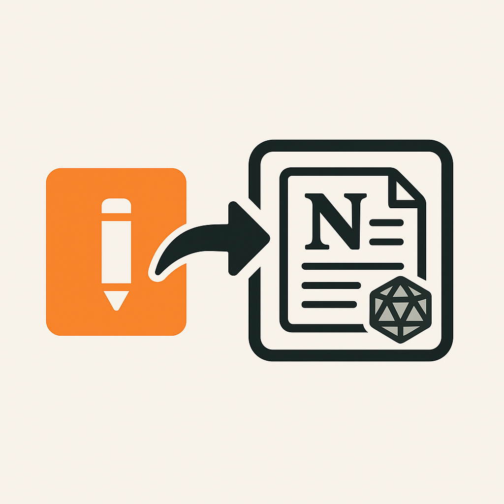

<p align="center">
  
</p>

<h1 align="center">Google Keep to Notion Converter</h1>

<p align="center">Convert Google Keep notes to Markdown and HTML with OCR and ChatGPT support.</p>

# Google Keep to Notion Converter

Convert your exported Google Keep notes (from Google Takeout) into clean, import-ready Markdown and HTML files for use in Notion — complete with OCR image processing and optional ChatGPT formatting.

---

## ✨ Features

- ✅ Parses `.json` notes from Google Keep exports
- 🖼️ Extracts and OCRs embedded images
- 🤖 Optionally formats text using ChatGPT (GPT-4)
- 📁 Outputs clean, structured Markdown and HTML by label
- 🗂️ Local caching for fast repeat runs

---

## 🚀 Quick Start

### 1. Clone the repository

```
git clone https://github.com/yourusername/gkeep-to-notion.git
cd gkeep-to-notion
```

### 2. Create a virtual environment and install dependencies 

```
python3 -m venv venv
source venv/bin/activate
pip install -r requirements.txt
```

### 3. Set your OpenAI API key (optional)
```
export OPENAI_API_KEY=your-openai-key
```

### 4. Export your Google Keep notes
- Go to Google Takeout
- Export only Google Keep
- Extract the .zip file and copy the Keep/ folder into the root of this project

### 5. Run the script
```
python main.py
```

## Command-line Arguments

The script now supports various command-line arguments:

```
python main.py --help
```

Options:
- `--debug`: Enable debug mode (process limited number of files)
- `--count`: Number of files to process in debug mode (default: 15)
- `--ocr-only`: Disable ChatGPT formatting (OCR only)
- `--input-folder`: Folder containing Google Keep JSON files (default: "Keep")
- `--attachments-folder`: Folder containing Google Keep attachments (default: "Keep")

Examples:
```
# Process only 5 files in debug mode
python main.py --debug --count 5

# Process without ChatGPT formatting
python main.py --ocr-only

# Specify custom folders
python main.py --input-folder my_keep_json --attachments-folder my_keep_attachments
```

## Output 

The script generates output in two folders:
- `output_markdown/`: Markdown files organized by labels
- `output_html/`: HTML files with interactive view of original images, OCR text, and formatted text

## Requirements

- Python 3.10+
- Tesseract OCR installed and available in your system PATH
- OpenAI API key (if ChatGPT formatting is enabled)

## Dependencies

Installable via `pip install -r requirements.txt`:
- aiohttp
- openai
- pytesseract
- pillow
- python-dotenv

## Caching

To avoid repeated OCR and API calls, the script saves intermediate results to:
- `ocr_cache/`: Raw OCR output
- `chatgpt_cache/`: ChatGPT-formatted Markdown

To clear the cache, simply delete those folders before re-running.

## Project Structure

The project has been refactored into a proper Python package structure:

```
gkeep_to_notion/
├── __init__.py              # Package initialization
├── cli.py                   # Command-line interface
├── config.py                # Configuration settings
├── utils.py                 # Utility functions
├── ocr.py                   # OCR functionality
├── api.py                   # ChatGPT API integration
├── processors.py            # Note and attachment processing
└── output.py                # Output generation (Markdown, HTML)
```

The main entry point is `main.py` in the project root.


## Notion Importer
The project also includes notion-importer, a Nodejs project to directly push translated notes into Notion utilizing the Notion API. 
This ensures that all imported pages maintain their correct relative organization and sort.

## License

[MIT](LICENSE)

Copyright (c) 2025 Michael Diener
